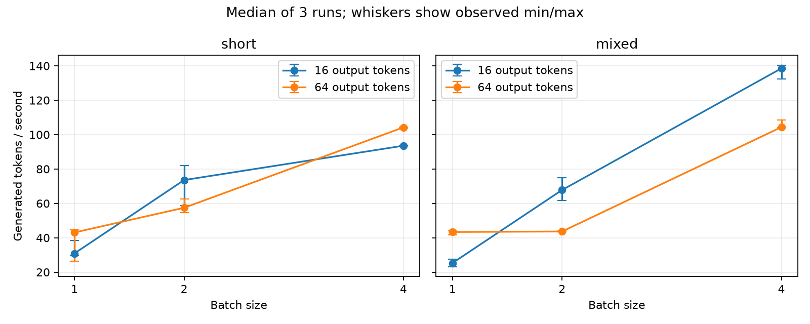
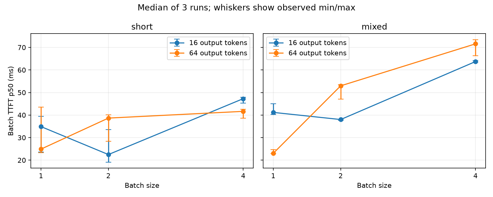
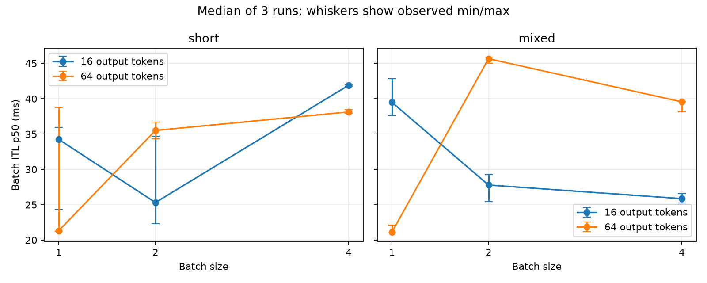

# Repeated manual-decode GPU experiment

## Scope and correctness

Model: Qwen/Qwen2.5-1.5B-Instruct (torch.float16); GPU: NVIDIA GeForce RTX 4080.
PyTorch 2.14.0+cu126; Transformers 5.17.0; CUDA 12.6.
All 12 exact-token comparisons passed: short and mixed prompts, batch sizes 1/2/4,
output lengths 1/16. Mixed batches 2/4 exercise left padding; a singleton cannot contain padding.
Both full token sequences and attention masks are in `correctness.json`.
The reference uses a fresh GenerationConfig: greedy argmax, no repetition or other logits
penalties, no EOS stopping or minimum-length EOS suppression, cache enabled, identical pad ID.
Thus EOS is selectable and generation continues for exactly the requested number of tokens.
The model's shipped generation defaults are deliberately not inherited. These comparisons
cover this model and these inputs; they do not prove equivalence for all models or prompts.

## Method

One model load, offline Hugging Face access, 12 shapes, 3 measured repeats per shape,
8 requests per repeat (288 measured requests). Each shape gets a complete 8-request
warmup using its own batch size, prompts, and output length. Shape order is shuffled with
seed 17; repeats within a shape are consecutive. All warmups and each measured run are saved.
Short workload repeats one prompt. Mixed workload adds context at repetition factors
1/4/12/24 twice; exact prompts and post-template token lengths are in the raw files.
Token capture is disabled during performance measurement.

Throughput includes tokenization, device transfers, generation, and Python result assembly
in `run_streaming` wall time, excluding model load and warmup. TTFT starts after input transfer
and position-ID preparation, at synchronized prefill start. ITL is the shared batch timeline,
not independent request timing. Every token selection synchronizes CUDA. Padding is
1 - total real input tokens / sum(batch size * batch maximum input length).
Memory is peak allocated CUDA memory, not reserved memory or full device usage.
CSV includes median, min, max, and sample standard deviation across repeats for all metrics;
latency columns aggregate per-run p50 values. Three repeats are not confidence intervals.

## Results

| Workload | Batch | Output | Padding | tok/s median [min, max] | TTFT p50 ms | ITL p50 ms | Peak MiB |
|---|---:|---:|---:|---:|---:|---:|---:|
| mixed | 1 | 16 | 0.0% | 25.30 [23.25, 27.39] | 41.18 | 39.50 | 3060.7 |
| mixed | 1 | 64 | 0.0% | 43.36 [41.80, 43.97] | 23.01 | 21.11 | 3062.1 |
| mixed | 2 | 16 | 23.4% | 67.79 [61.76, 74.98] | 38.01 | 27.78 | 3172.5 |
| mixed | 2 | 64 | 23.4% | 43.64 [43.42, 44.02] | 52.96 | 45.66 | 3175.7 |
| mixed | 4 | 16 | 52.9% | 138.53 [132.40, 140.26] | 63.72 | 25.86 | 3392.7 |
| mixed | 4 | 64 | 52.9% | 104.37 [104.02, 108.41] | 71.58 | 39.55 | 3399.1 |
| short | 1 | 16 | 0.0% | 30.90 [29.71, 38.30] | 34.88 | 34.24 | 2965.9 |
| short | 1 | 64 | 0.0% | 43.07 [26.45, 44.72] | 24.89 | 21.33 | 2967.2 |
| short | 2 | 16 | 0.0% | 73.58 [58.85, 82.03] | 22.48 | 25.31 | 2979.3 |
| short | 2 | 64 | 0.0% | 57.46 [54.66, 62.71] | 38.66 | 35.51 | 2981.9 |
| short | 4 | 16 | 0.0% | 93.54 [93.47, 93.88] | 47.27 | 41.92 | 3006.8 |
| short | 4 | 64 | 0.0% | 104.21 [103.89, 104.48] | 41.64 | 38.13 | 3012.0 |

- short, 16 output tokens: batch 4 / batch 1 throughput = 3.03x.
- short, 64 output tokens: batch 4 / batch 1 throughput = 2.42x.
- mixed, 16 output tokens: batch 4 / batch 1 throughput = 5.48x.
- mixed, 64 output tokens: batch 4 / batch 1 throughput = 2.41x.

Maximum throughput sample coefficient of variation across the 12 shapes: 26.54%.
All measured requests completed with zero errors. Larger batches improve aggregate throughput
in the comparisons above, while mixed prompt padding increases input work. This is a bounded
local measurement; run order, GPU clocks, desktop load, and only three repeats limit inference.
It is not a controlled causal estimate of padding overhead or production capacity. No network,
continuous batching, queueing service, or concurrent-client behavior is measured.

## Plots





## Reproduction

From the repository root (choose a new output directory; existing outputs are refused):

```bash
HF_HUB_OFFLINE=1 .venv/Scripts/python.exe run_experiments.py --output experiments/repeated_gpu_run
```

Install plotting dependency only in the project venv if needed:
`uv pip install --python .venv/Scripts/python.exe matplotlib==3.11.2`.
See `metadata.json`, `aggregate.csv`, `raw_index.json`, individual `raw_*.json`,
and `warmup_*.json`. Existing baseline and validation artifacts were preserved.
